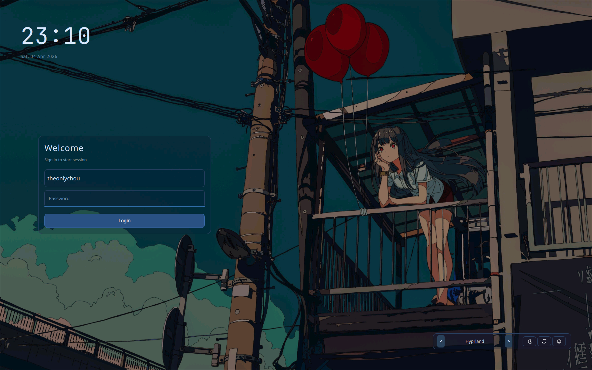
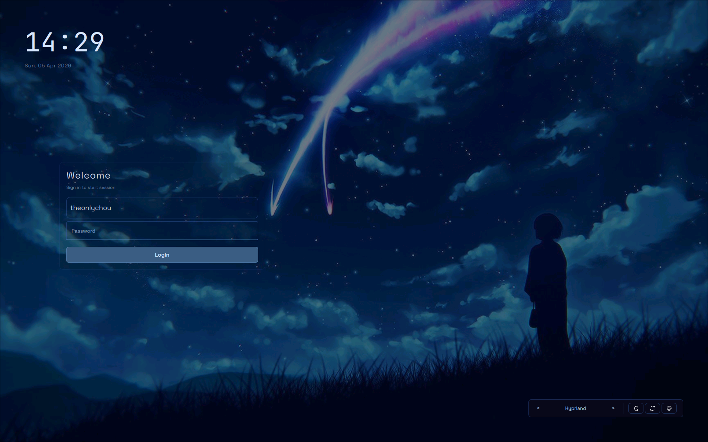
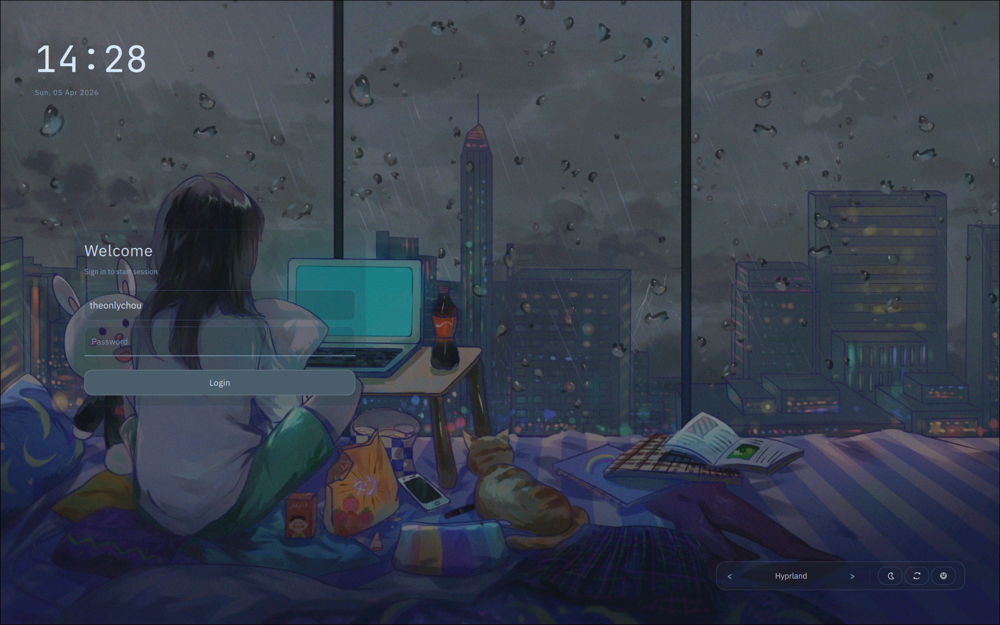
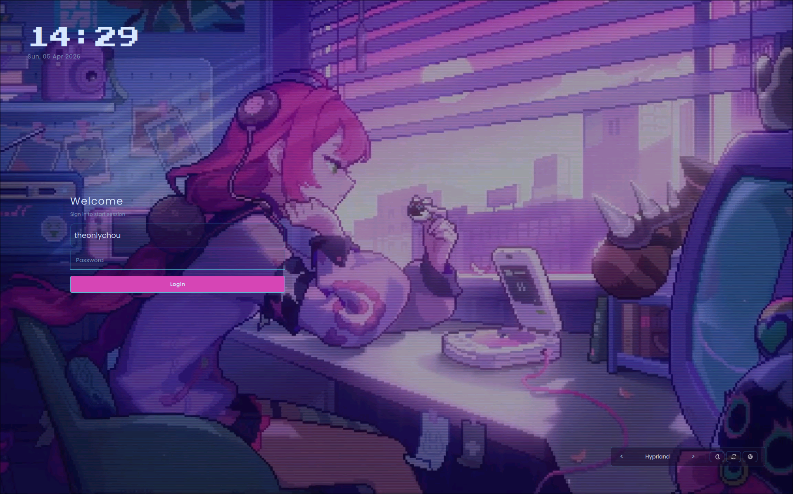

# NightframeSDDM

NightframeSDDM is a custom dark cinematic SDDM theme built with Qt6/QML.

V4 introduces preset identities that are visually distinct at a glance, not only numerically different.

It keeps wallpaper visibility high, uses a minimal login surface, and includes SVG power controls with optional video background support.

## Features

- Identity-driven presets (default, night, rain, pixel)
- Stable image-first mode (default, night, rain)
- Optional video background mode with safe fallback (pixel)
- Automatic fallback to image when video fails
- Modular QML architecture for maintainability
- Preset system via `presets/*.conf`
- SVG icon power controls (sleep, reboot, shutdown)

## V4 Preset Identities

- `default`: balanced urban-anime baseline, teal-cyan accent, clean readable spacing
- `night`: deeper premium cinematic blue, sharper radii, restrained compact controls
- `rain`: softer atmospheric grey-blue, rounder panel geometry, calmer cozy spacing
- `pixel`: neon arcade mood, compact squarer controls, video-first with robust fallback

## Presets Preview

| **Default** | **Night** |
|---|---|
|  |  |

| **Rain** | **Pixel** |
|---|---|
|  |  |

## Project Tree

~~~text
NightframeSDDM/
├── assets/
│   ├── backgrounds/
│   ├── fonts/
│   ├── svg/
│   └── video/
├── components/
│   ├── Auth/
│   ├── Background/
│   ├── Common/
│   ├── Power/
│   ├── Session/
│   └── Widgets/
├── docs/
│   ├── customization.md
│   └── structure.md
├── presets/
│   ├── default.conf
│   ├── night.conf
│   ├── pixel.conf
│   └── rain.conf
├── scripts/
│   ├── install.sh
│   └── test.sh
├── Main.qml
├── metadata.desktop
├── qmldir
├── README.md
└── theme.conf
~~~

## Dependencies

- SDDM with Qt6 greeter (`sddm-greeter-qt6` preferred)
- Qt6 QML runtime
- Qt Multimedia (only required for optional video mode)

## Local Testing

Preset-driven testing:

~~~bash
./scripts/test.sh --preset default
./scripts/test.sh --preset night
./scripts/test.sh --preset rain
./scripts/test.sh --preset pixel
~~~

List available presets:

~~~bash
./scripts/test.sh --list-presets
~~~

Reduce local multimedia warning noise:

~~~bash
NIGHTFRAME_QUIET_TEST=1 ./scripts/test.sh --preset pixel
~~~

## Install Workflow

Install to the standard SDDM location:

~~~bash
./scripts/install.sh
~~~

Install with preset:

~~~bash
./scripts/install.sh --preset default
./scripts/install.sh --preset night
./scripts/install.sh --preset rain
./scripts/install.sh --preset pixel
~~~

Custom target path:

~~~bash
./scripts/install.sh --target /usr/share/sddm/themes/NightframeSDDM
~~~

## Image vs Optional Video

- Image mode is the safe default.
- Video mode is opt-in.
- If video decode/backend/media fails, the UI remains usable and falls back to image rendering.

## Configuration and Presets

- `theme.conf` is the active runtime config.
- `Preset=<name>` indicates the intended style preset.
- `presets/*.conf` are complete config variants that can be applied via scripts.

Primary V4 style keys:

- `UiFont`
- `ClockFont`
- `AccentColor`
- `SecondaryAccentColor`
- `OverlayStrength`
- `OverlayTint`
- `PanelTint`
- `PanelOpacity`
- `PanelRadius`
- `ControlDensity`
- `ClockScale`
- `TitleOpacity`
- `SubtitleOpacity`
- `BottomControlsOpacity`
- `PanelHorizontalOffset`
- `PanelVerticalOffset`
- `SessionStyle`
- `TransitionProfile`
- `ControlSpacing`
- `PanelBorderStrength`

See:

- `docs/structure.md`
- `docs/customization.md`

## Notes on Multimedia Warnings

Warnings about FFmpeg, VAAPI, VDPAU, Bluez, or device sample formats in test mode are usually environment/runtime warnings, not necessarily theme logic errors.